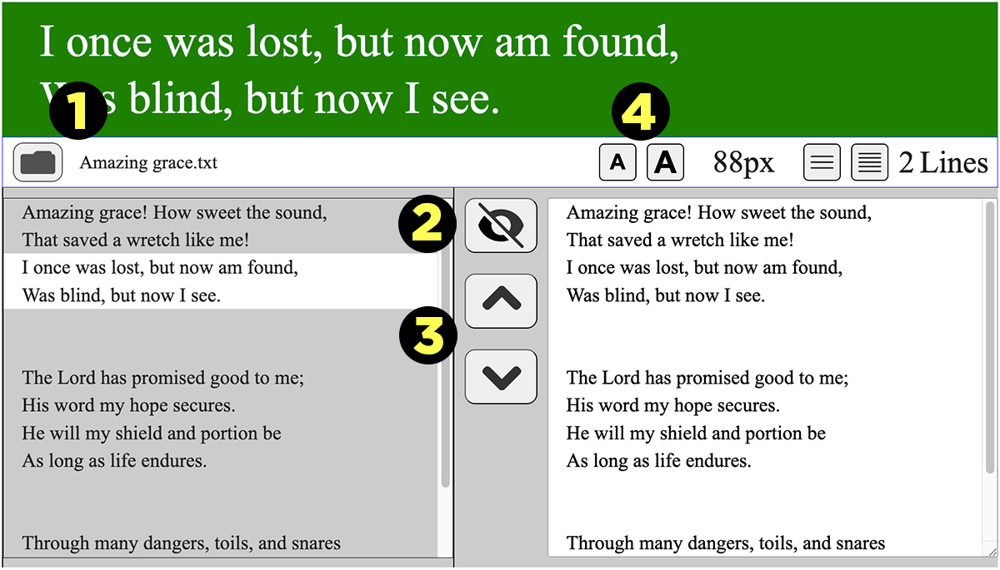

# song-lyrics-js-ts

Display song lyrics on a green screen to be used as a Browser source in Open 
Broadcast Studio (OBS) to overlay on a video or image.

## Usage

1. Download song-lyrics-0.9.1.zip
2. After unzipping, open **index.html** in a browser

### Controls

1. [Open File](img-readme/controls-1-open-file.jpg)
2. [Show](img-readme/controls-2-lyrics-show.jpg) / [Hide](img-readme/controls-2-lyrics-hide.jpg) Lyrics (displayed at the top)
3. [Next / Previous](img-readme/controls-3-next-prev-lyrics.jpg), show next/previous lyric lines
4. [Text Size](img-readme/controls-4-text-size.jpg), increase or decrease text size



Lyrics in the edit window on the right can be edited. Click on the left 
preview window to show changes. 


### In OBS
The main purpose of this application is to display lyrics overlayed on, for 
example, a live video feed in OBS.

[Lyrics overlay example in OBS (image)](img-readme/lyrics-overlay-sample.jpg)

Set it up in OBS like this.

#### Add Browser source
1. Add a **Browser** source to your scene and name it
2. Set as **Local file**
3. Browse to **index.html** and select it
4. Set **Width** to 1920 and **Height** to 1080
5. **OK** to save

[Browser source in OBS (image)](img-readme/lyrics-overlay-browser-source.jpg)

#### Add Chroma Key filter to Browser source
1. Click on **Filters**
2. Add an **Effect** Filter
3. Select **Chroma Key** and name it
4. Accept the defaults (default **Key Color Type** is **Green**)
5. **Close** to save

[Chroma Key filter in OBS (image)](img-readme/lyrics-overlay-filter-chroma-key.jpg)

The background color of the lyrics display area at the top is CSS Green, 
#008000, which works great with the default Key Color Type of Green in the 
Chroma Key effect filter.

#### Modify Browser source overlay
Place the browser source overlay where you want on the screen, usually at the 
bottom. It should fit perfectly in an HD video frame (1920x1080). Trim the 
lower part to see only the lyrics with the green background, which should 
appear as white text floating over your video. Press **Alt** while you use the 
mouse to drag the bottom handle up to hide everything below the lyrics 
display area.

#### Add a drop shadow and transparent color overlay
If you want a drop shadow, install the popular 
[obs-shaderfilter](https://obsproject.com/forum/resources/obs-shaderfilter.1736/), 
currently version 2.3.2 (as of June 19, 2023).

1. Select **Filters**
2. Add an **Effect Filter** and name it
3. Select **User-defined shader**
4. Select **Load shader text from file**
5. Click **Browse** to find the **drop_shadow.shader** and select it
6. Scroll down and set the following (for example):
   1. **Shadow offset x:** 3
   2. **Shadow offset y:** 3
   3. **Shadow blur size:** 3
   4. **shadow color** #ff000000 (black)

[Drop shadow shader filter in OBS (image)](img-readme/lyrics-overlay-filter-drop-shadow-shader.jpg)

#### Interact with the Browser source to display next lyrics
Select the Interact button to open a dialog that shows the browser page with 
the Next, Prev, and Select File buttons. You can only select the next or 
previous lyrics in this dialog. If you want the lyrics to disappear at the 
end, add a couple blank lines so the Next button will eventually advance to 
the blank lines.

[Interact with Browser source in OBS (image)](img-readme/lyrics-overlay-browser-interact.jpg)

## Customize and Build project

If you make changes to the **src/ts/song-lyrics.ts** TypeScript file, 
they must be compiled into the **js/song-lyrics.js** JavaScript file, 
which is the code that **index.html** uses. To be able to compile, you'll need 
[Node.js and NPM](https://docs.npmjs.com/downloading-and-installing-node-js-and-npm) 
installed first to run the following in the project root directory to install 
the dependencies.

```sh
npm install
```

Then compile the modified **song-lyrics.ts** TypeScript file into the 
JavaScript file, **dist/js/song-lyrics.js** that's used by index.html.

```sh
npm run build
```

Changes to **index.html** and **css/style.css** take effect immediately. You don't 
need to compile anything.

For different SVG icons, try [IconFinder.com](https://www.iconfinder.com/); for 
example [FatIcons](https://www.iconfinder.com/iconsets/faticons) and 
[Flat UI Icons](https://www.iconfinder.com/iconsets/flat-ui-icons-24-px) and 
[Jumpicon](https://www.iconfinder.com/search/icons?family=jumpicon-glyph). and 
[Font Awesome Regular](https://www.iconfinder.com/search/icons?family=font-awesome-regular) icons.

## Project Setup

```sh
npm install
```

### Compile and Hot-Reload for Development

```sh
npm run dev
```

### Compile and Minify for Production

```sh
npm run build
```
