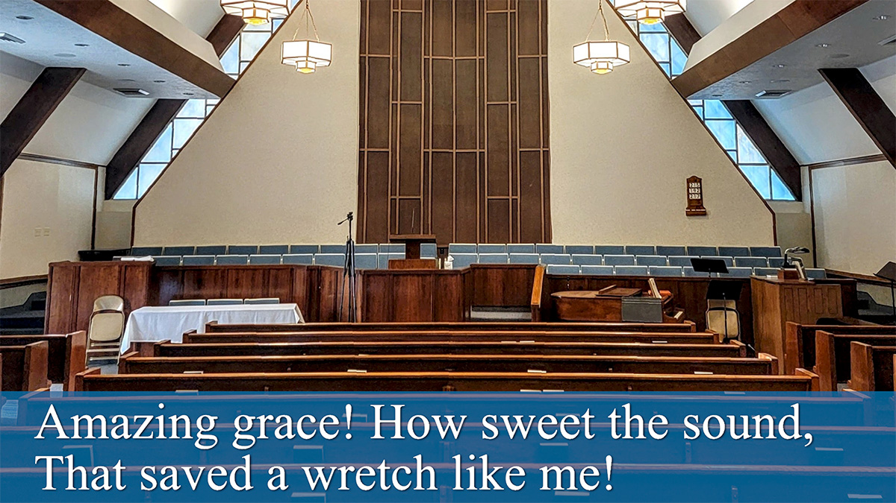

# song-lyrics-js-ts

Display song lyrics on a green screen to be used as a Browser source in Open 
Broadcast Studio (OBS) to overlay on a video or image.

By implementing it as a Browser source in OBS, you can interact with it in OBS, 
which simplifies the process. No other applications are needed 

## How to use in a browser

1. Go to latest release in GitHub under **Releases** at the right.
2. Download the [song-lyrics-(version).zip](https://github.com/laurenra/song-lyrics-js-ts/releases/download/v0.9.1/song-lyrics-0.9.1.zip) file.
3. Unzip the file and open **index.html** in a browser

### Controls

1. [Open File](img-readme/controls-1-open-file.jpg)
2. [Show](img-readme/controls-2-lyrics-show.jpg) / [Hide](img-readme/controls-2-lyrics-hide.jpg) Lyrics (displayed at the top)
3. [Next / Previous](img-readme/controls-3-next-prev-lyrics.jpg), show next/previous lyric lines
4. [Text Size](img-readme/controls-4-text-size.jpg), increase or decrease text size


Lyrics in the edit window on the right can be edited. Click on the left 
preview window to show changes. 

## How to use in OBS
The main purpose of this application is to display lyrics overlayed on, for 
example, a live video feed in OBS.



Set it up in OBS like this.

### Add Browser source
1. Add a **Browser** source to your scene and name it
2. Set as **Local file**
3. Browse to **index.html** and select it
4. Set **Width** to 1920 and **Height** to 1080
5. **OK** to save

### Add Chroma Key filter to Browser source
1. Click on **Filters**
2. Add an **Effect** Filter
3. Select **Chroma Key** and name it
4. Accept the defaults (default **Key Color Type** is **Green**)
5. **Close** to save

The background color of the lyrics display area at the top is CSS Green, 
#008000, which works great with the default Key Color Type of Green in the 
Chroma Key effect filter.

### Modify Browser source overlay
Place the browser source overlay where you want on the screen, usually at the 
bottom. It should fit perfectly in an HD video frame (1920x1080). Trim the 
lower part to see only the lyrics with the green background, which should 
appear as white text floating over your video. Press **Alt** while you use the 
mouse to drag the bottom handle up to hide everything below the lyrics 
display area.

### Add a drop shadow and transparent color overlay
If you want a drop shadow, install the popular 
[obs-shaderfilter](https://obsproject.com/forum/resources/obs-shaderfilter.1736/), 
currently version 2.3.2 (as of June 19, 2023).

1. Select **Filters**
2. Add an **Effect Filter** and name it
3. Select **User-defined shader**
4. Select **Load shader text from file**
5. Click **Browse** to find the **drop_shadow.shader** and select it
6. Scroll down and set the following (for example):
   1. **Shadow offset x:** 3
   2. **Shadow offset y:** 3
   3. **Shadow blur size:** 3
   4. **shadow color** #ff000000 (black)

### Interact with the Browser source to display next lyrics
Select the Interact button to open a dialog that shows the browser page with 
the Next, Prev, and Select File buttons. You can only select the next or 
previous lyrics in this dialog. If you want the lyrics to disappear at the 
end, add a couple blank lines so the Next button will eventually advance to 
the blank lines.

## Customize and Build project

If you make changes to the **src/ts/song-lyrics.ts** TypeScript file, 
they must be compiled into the **js/song-lyrics.js** JavaScript file, 
which is the code that **index.html** uses. To be able to compile, you'll need 
[Node.js and NPM](https://docs.npmjs.com/downloading-and-installing-node-js-and-npm) 
installed first to run the following in the project root directory to install 
the dependencies.

```sh
npm install
```

Then compile the modified **song-lyrics.ts** TypeScript file into the 
JavaScript file, **dist/js/song-lyrics.js** that's used by index.html.

```sh
npm run build
```

Changes to **index.html** and **css/style.css** take effect immediately. You don't 
need to compile anything.

For other build options, see **Project Setup** below.

For different SVG icons, try:

- [freesvgicons.com](https://freesvgicons.com/)
- [svgrepo.com](https://www.svgrepo.com/)

### Create downloadable package of /dist directory for a release version

Zip everything in the /dist directory and its subdirectories into a file named
'song-lyrics-{release version}.zip' and upload to GitHub when you create a
[release version](https://docs.github.com/en/repositories/releasing-projects-on-github/managing-releases-in-a-repository),
for example:

```shell
zip -r song-lyrics-1.5.2.zip dist
```

## Project Setup

```sh
npm install
```

### Compile and Minify for Production
Uses Webpack to create `/dist` directory and copy files there. The `/dist` directory 
has all files needed to run this in a browser.

```sh
npm run build
```
### Compile to debug TypeScript in a browser 
Only updates the files in `/dist/js` to create a debug version of the .js file and 
a *.js.map file to map the TypeScript to the generated JavaScript so the browser 
debugger steps through the code correctly.

```sh
npm run build-ts
```

### Verbose debug compile to see compile process steps
Same as `run build-ts` above with verbose message output during compile.

```sh
npm run build-ts-debug
```
